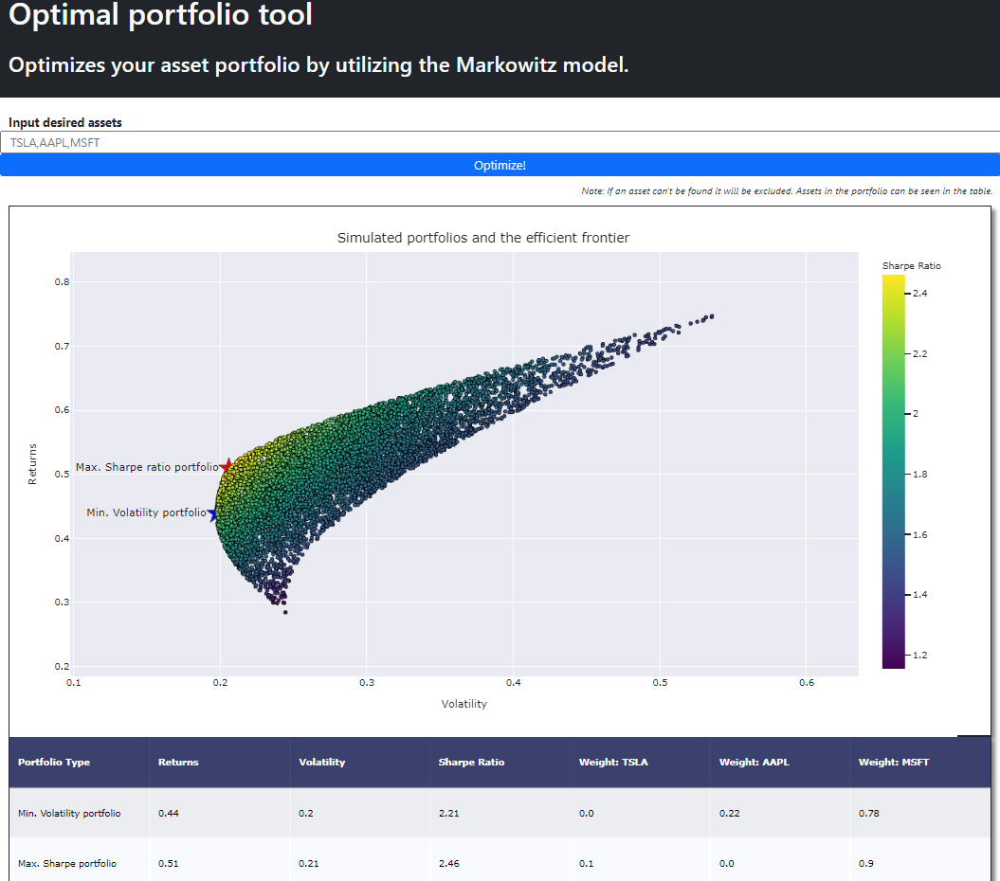

# Portfolio-Optimization
The objective is to optimize a portfolio of given assets using Modern Portfolio Theory (MPT).

### Next steps

- [x] Optimize asset portfolio using Monte Carlo sampling with uniform A priori distribution
- [x] Automate data retrieval
- [ ] Dockerize
    - Asset selection in tool
    - Does the tool work again and again without errors?
    - Find a way to not retrieve the data twice
    - Find a way to deploy our pipeline to the public (Heroku, AWS,...)
- [ ] Write extensive README with the theory behind the optimization
- [ ] Time series prediction -> Robust portfolio optimization using future scenarios (?)
